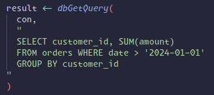
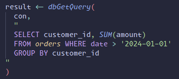

# DuckDB R Editor (Positron)

> [!WARNING]
> This is a beta version. Please report issues on [GitHub](https://github.com/h-a-graham/duckdb-r-editor/issues).

> [!NOTE]
> **Positron IDE Only** - This extension requires [Positron](https://github.com/posit-dev/positron) and will not work in VS Code.

**SQL syntax highlighting and intelligent autocomplete for DuckDB in R files.**

Write DuckDB SQL with full IDE support - syntax highlighting, autocomplete, and schema introspection - right inside R strings. Queries your active R session directly via Positron API - **no file locking issues**.

---

## Visual Showcase

<table>
<tr>
<td width="50%">

### Before: No SQL Support


</td>
<td width="50%">

### After: Full SQL IDE Features


</td>
</tr>
</table>

### Autocomplete in Action

> 🎬 **GIF PLACEHOLDER**: Coming soon - full autocomplete demo

---

## Key Features

| Feature | Description |
|---------|-------------|
| 🎨 **Syntax Highlighting** | Context-aware SQL highlighting in R strings (keywords, functions, tables, columns) |
| 🧠 **Smart Autocomplete** | 900+ DuckDB functions + live schema from your R session |
| 🔌 **R Connection Selection** | QuickPick UI to select specific R DuckDB connection objects |
| 💾 **In-Memory Support** | Full support for `:memory:` databases |
| 🚫 **No File Locking** | Queries R session directly - no database file conflicts |
| ⚙️ **Auto-Load Extensions** | Configure extensions in settings.json to load on startup |
| ✈️ **Air Formatter Support** | Works with multi-line SQL strings |
| 🔍 **DuckDB-Specific** | Support for `INSTALL`, `LOAD`, `DESCRIBE`, `SUMMARIZE`, etc. |

[📖 **Detailed Features Guide** →](docs/FEATURES.md)

---

## Quick Start

### 1. Install

**Prerequisites:**
- [Positron IDE](https://github.com/posit-dev/positron)
- R with `DBI` and `duckdb` packages
- Node.js 16+ (for building)

```bash
# Clone and build
git clone https://github.com/h-a-graham/duckdb-r-editor.git
cd duckdb-r-editor
npm install
npm run package

# Install the .vsix file in Positron:
# Extensions → ... menu → Install from VSIX
```

### 2. Create R Connection

```r
library(DBI)
library(duckdb)

con <- dbConnect(duckdb(), "mydata.duckdb")
# Or use in-memory: dbConnect(duckdb(), ":memory:")
```

### 3. Connect Extension

1. Open Command Palette (`Cmd/Ctrl + Shift + P`)
2. Run: **"DuckDB R Editor: Connect to DuckDB Database"**
3. **Select your R connection object** (e.g., "con")
4. Start writing SQL with autocomplete!

### 4. Write SQL

SQL autocomplete works automatically in:
```r
dbGetQuery()
dbExecute()
dbSendQuery()
sql()        # dbplyr
glue_sql()   # glue package
```

---

## Configuration

Optional: Add to `.vscode/settings.json`

```json
{
  "duckdb-r-editor.defaultExtensions": ["spatial", "httpfs", "json"],
  "duckdb-r-editor.useSemanticHighlighting": true,
  "duckdb-r-editor.enableAutoComplete": true
}
```

[⚙️ **Full Configuration Guide** →](docs/CONFIGURATION.md)

---

## Documentation

- 📖 [Detailed Features](docs/FEATURES.md) - Complete feature documentation
- ⚙️ [Configuration Guide](docs/CONFIGURATION.md) - Settings and extension loading
- 💡 [Workflow & Tips](docs/WORKFLOW.md) - Best practices and troubleshooting
- 🏗️ [Architecture](docs/POSITRON_CHANGES.md) - How it works under the hood

---

## Commands

| Command | Description |
|---------|-------------|
| **Connect to DuckDB Database** | Select R connection object to use for schema |
| **Disconnect from Database** | Close connection |
| **Refresh DuckDB Schema** | Re-query R session for updated schema |
| **Load DuckDB Extension (One-Time)** | Load extension for autocomplete (until restart) |

Access via Command Palette (`Cmd/Ctrl + Shift + P`)

---

## Why This Extension?

DuckDB in R is incredibly powerful for data analysis - but writing SQL in plain strings is painful. Without IDE support, you're left guessing table names, column types, and function signatures. Typos go unnoticed until runtime, and exploring your database schema means constant trips to the R console.

This extension brings full SQL IDE features into R strings: syntax highlighting, intelligent autocomplete, and schema introspection from your active connection. Write SQL with confidence, catch errors early, and explore your data without breaking flow.

---

## License

MIT

## Acknowledgments

Built for the DuckDB and R communities. Special thanks to:
- **DuckDB** - Amazing analytical database
- **Positron** - Excellent data science IDE
- **Air formatter** - Clean R code formatting
- **Claude Code** - For helping generate this extension
- R packages: `DBI`, `duckdb`, `dbplyr`, `glue`

---

## Contributing

Found a bug? Have a feature request?

[Open an issue on GitHub](https://github.com/h-a-graham/duckdb-r-editor/issues)
